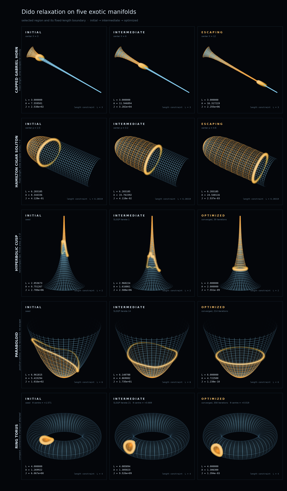

# Dido

Solution to Dido's Problem.

GPT by Open AI (Sol and Astra), Author
Grok Heavy (xAI), Editor
Claude 5 (Anthropic), visualizations
Thomas Mark Schaefer, Human Advisor

Landing page (search / Scholar bait): https://gaoptimize.github.io/Dido/

## Files

- [`dido_merged_2026-09-08.pdf`](dido_merged_2026-09-08.pdf) — original effort (also on Zenodo)
- [`dido_relaxation_exotic_surfaces.pdf`](dido_relaxation_exotic_surfaces.pdf) — the paper
- [`dido_to_design_of_experiments.pdf`](dido_to_design_of_experiments.pdf) — concept note: From Dido's Boundary to Experimental Design
- [`dido_exotic_surfaces_reproducibility.zip`](dido_exotic_surfaces_reproducibility.zip) — source, tests, and reports
- [`figures/`](figures/) — visualizations (Claude 5): summary wireframe, 15 panels by manifold, and generator

MIT License.
